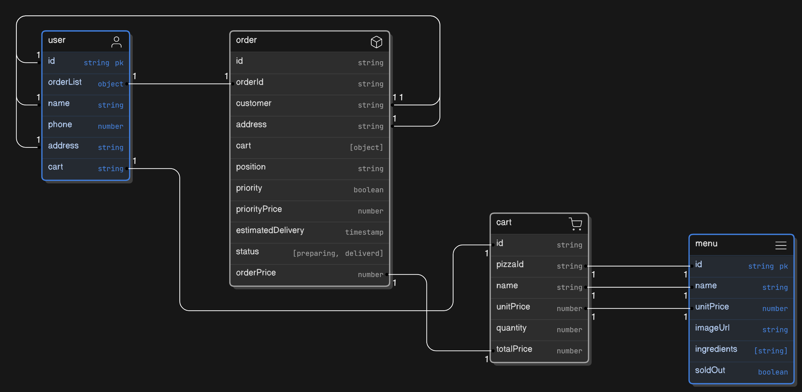

# fast-react-pizza-backend



## API DOCUMENTATION

https://documenter.getpostman.com/view/39075238/2sAY547KHi

## Get Menu

This endpoint retrieves the menu items available.

### Request

#### HTTP Request

`GET {{url}}/api/menu`

### Response

- `statusCode` (number): The status code of the response.

- `data` (array): An array of menu items, each containing the following:

    - `id` (string): The unique identifier of the menu item.

    - `name` (string): The name of the menu item.

    - `imageUrl` (string): The URL of the image for the menu item.

    - `ingredients` (array): An array of ingredients used in the menu item.

    - `unitPrice` (number): The price of the menu item.

    - `soldOut` (boolean): Indicates whether the menu item is sold out.

- `message` (string): A message related to the response.

- `success` (boolean): Indicates the success status of the request.

#### Example

``` json
{
    "statusCode": 200,
    "data": [
        {
            "id": "672a7397ce8e9e646ee108f0",
            "name": "Margherita",
            "imageUrl": "https://dclaevazetcjjkrzczpc.supabase.co/storage/v1/object/public/pizzas/pizza-1.jpg",
            "ingredients": [
                "tomato",
                "mozzarella",
                "basil"
            ],
            "unitPrice": 12,
            "soldOut": false
        }
    ],
    "message": "Success",
    "success": true
}

 ```

## Create Order

This endpoint allows the client to place a new order by sending a POST request to the specified URL. The request should
include details such as customer information, contact details, order items, priority, and delivery location.

### Response JSON Schema

``` json
{
    "type": "object",
    "properties": {
        "statusCode": {
            "type": "number"
        },
        "data": {
            "type": "object",
            "properties": {
                "customer": {
                    "type": "string"
                },
                "customerId": {
                    "type": "string"
                },
                "address": {
                    "type": "string"
                },
                "cart": {
                    "type": "array",
                    "items": {
                        "type": "object",
                        "properties": {
                            "pizzaId": {
                                "type": "string"
                            },
                            "name": {
                                "type": "string"
                            },
                            "quantity": {
                                "type": "number"
                            },
                            "unitPrice": {
                                "type": "number"
                            },
                            "totalPrice": {
                                "type": "number"
                            },
                            "_id": {
                                "type": "string"
                            }
                        }
                    }
                },
                "position": {
                    "type": "string"
                },
                "priority": {
                    "type": "boolean"
                },
                "_id": {
                    "type": "string"
                },
                "createdAt": {
                    "type": "string"
                },
                "updatedAt": {
                    "type": "string"
                },
                "estimatedDelivery": {
                    "type": "string"
                },
                "orderId": {
                    "type": "string"
                },
                "orderPrice": {
                    "type": "number"
                },
                "priorityPrice": {
                    "type": "number"
                },
                "status": {
                    "type": "string"
                },
                "__v": {
                    "type": "number"
                }
            }
        },
        "message": {
            "type": "string"
        },
        "success": {
            "type": "boolean"
        }
    }
}

 ```

## Get Order Details

The API returns a JSON response with the following schema:

``` json
{
    "statusCode": "number",
    "data": {
        "_id": "string",
        "customer": "string",
        "customerId": "string",
        "address": "string",
        "cart": [
            {
                "pizzaId": "string",
                "name": "string",
                "quantity": "number",
                "unitPrice": "number",
                "totalPrice": "number",
                "_id": "string"
            }
        ],
        "position": "string",
        "priority": "boolean",
        "createdAt": "string",
        "updatedAt": "string",
        "estimatedDelivery": "string",
        "orderId": "string",
        "orderPrice": "number",
        "priorityPrice": "number",
        "status": "string",
        "__v": "number"
    },
    "message": "string",
    "success": "boolean"
}

 ```

## User Login

This endpoint allows the user to log in using their phone number.

### Request Body

- phone (text, required): The phone number of the user.

### Response

The response will be in JSON format with the following schema:

``` json
{
    "type": "object",
    "properties": {
        "statusCode": {
            "type": "number"
        },
        "data": {
            "type": "object",
            "properties": {
                "_id": {
                    "type": "string"
                },
                "name": {
                    "type": "string"
                },
                "phone": {
                    "type": "string"
                },
                "address": {
                    "type": "string"
                },
                "orderList": {
                    "type": "array",
                    "items": {
                        "type": "object",
                        "properties": {
                            "orderId": {
                                "type": "string"
                            },
                            "estimatedDelivery": {
                                "type": "string"
                            },
                            "createdAt": {
                                "type": "string"
                            },
                            "_id": {
                                "type": "string"
                            }
                        }
                    }
                },
                "createdAt": {
                    "type": "string"
                },
                "updatedAt": {
                    "type": "string"
                },
                "__v": {
                    "type": "number"
                }
            }
        },
        "message": {
            "type": "string"
        },
        "success": {
            "type": "boolean"
        }
    }
}

 ```

## User Details

The endpoint retrieves user information based on the provided user ID. The response returns a JSON object with the
following schema:

``` json
{
  "statusCode": "number",
  "data": {
    "_id": "string",
    "name": "string",
    "phone": "string",
    "address": "string",
    "orderList": [
      {
        "orderId": "string",
        "estimatedDelivery": "string",
        "createdAt": "string",
        "_id": "string"
      }
    ],
    "createdAt": "string",
    "updatedAt": "string",
    "__v": "number"
  },
  "message": "string",
  "success": "boolean"
}

 ```